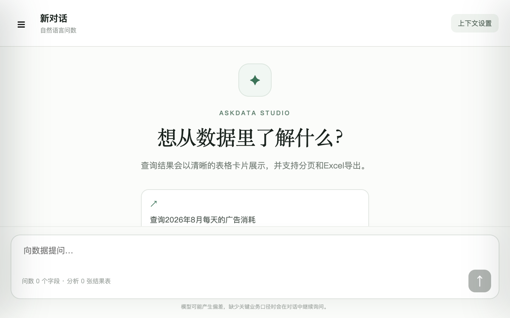
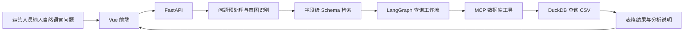

# AskData Studio

面向短视频运营场景的自然语言问数应用。用户可以用自然语言提出数据问题，系统检索字段级 Schema、生成并执行只读 SQL，再以表格和分析说明呈现结果。

> 本项目是可本地运行的演示项目，数据为脚本生成的模拟数据，不面向生产环境。

[](https://github.com/wohenkunkun-tech/askdata-studio-ops)

## 界面预览



## 项目亮点

- **自然语言问数**：将运营问题路由为数据查询或数据问答，支持缺少关键信息时继续澄清。
- **字段级 Schema 检索**：基于表、字段、业务描述和数据样例查找相关 Schema，为 SQL 生成提供上下文。
- **只读 SQL 执行**：通过 MCP 工具调用 DuckDB 查询 CSV 数据，展示查询结果、分页和导出能力。
- **权限隔离**：按运营角色限制可访问的数据表，覆盖用户增长、渠道投放和内容运营场景。
- **可复用的查询上下文**：可收藏关键字段、保存查询结果，并将历史结果作为综合分析参考。
- **可评测**：包含单元测试、数据完整性校验脚本，以及覆盖多个运营领域的标准查询评测集。

## 技术栈

| 部分 | 技术 |
| --- | --- |
| 前端 | Vue 3、TypeScript、Vite |
| 后端 API | Python 3.11、FastAPI |
| 工作流 | LangGraph |
| 查询引擎 | DuckDB |
| 工具调用 | MCP（进程内工具服务） |
| 模型服务 | 兼容 OpenAI API 的 Chat、Embedding 和 Rerank 服务 |

## 查询流程



## 数据集

- **41 张 CSV 表，约 72 万行模拟数据**，覆盖用户增长、渠道投放和内容运营。
- 数据由 `backend/scripts/generate_short_video_ops_data.py` 生成，可用固定随机种子复现。
- 当前数据日期范围为 **2026-01-01 至 2026-08-28**。
- Schema 文件包含字段描述、样例值、数据概况和表关系，用于辅助检索与查询。

## 本地运行

### 环境要求

- Python 3.11
- Node.js 20.19 或更高版本（推荐使用 Node.js LTS）
- 一个兼容 OpenAI API 的模型服务及相应的 Chat、Embedding、Rerank 模型权限

### 1. 安装后端

macOS / Linux：

```bash
cd backend
python3.11 -m venv .venv
./.venv/bin/python -m pip install -r requirements.txt
cp .env.example .env
```

Windows PowerShell：

```powershell
cd backend
py -3.11 -m venv .venv
.\.venv\Scripts\python.exe -m pip install -r requirements.txt
Copy-Item .env.example .env
```

编辑 `backend/.env`，填写模型服务提供的 API Key 和对应模型配置。默认示例配置见 [`backend/.env.example`](backend/.env.example)。

**不要将 `backend/.env`、API Key 或其他访问凭据提交到 GitHub。** API 调用可能产生费用，请先确认模型服务的计费方式。

### 2. 安装前端

在项目根目录执行：

```bash
cd frontend
npm ci
```

### 3. 启动服务

分别打开两个终端窗口。

终端一：启动后端 API

```bash
cd backend
# macOS / Linux
./.venv/bin/python run.py
```

Windows PowerShell 则运行：

```powershell
.\.venv\Scripts\python.exe run.py
```

终端二：启动前端

```bash
cd frontend
npm run dev
```

打开 `http://127.0.0.1:5173` 使用应用；FastAPI 接口文档位于 `http://127.0.0.1:8000/docs`。

### 演示账号

| 角色 | 账号 | 密码 |
| --- | --- | --- |
| 管理员（所有数据） | `admin` | `admin123` |
| 用户增长运营 | `growth` | `growth123` |
| 渠道投放运营 | `channel` | `channel123` |
| 内容运营 | `content` | `content123` |

这些账号仅用于本地演示；项目认证和默认凭据不适合直接用于生产部署。

## 测试与评测

在 `backend` 目录运行单元测试和数据校验：

```bash
./.venv/bin/python -m unittest discover -s tests -p 'test_*.py'
./.venv/bin/python scripts/validate_short_video_ops.py
```

运行全部标准 SQL 的离线评测（不调用模型服务）：

```bash
./.venv/bin/python -m evaluation.run_benchmark --mode gold --scope all
```

经典冒烟用例及完整在线评测会调用模型服务，可能产生费用：

```bash
./.venv/bin/python -u -m evaluation.run_benchmark --mode live --scope classic
./.venv/bin/python -u -m evaluation.run_benchmark --mode live --scope all
```

更多指标和评测说明见 [`backend/evaluation/README.md`](backend/evaluation/README.md)。

## 项目结构

```text
.
├── backend/
│   ├── app/                 # FastAPI、LangGraph 工作流、检索、MCP 与查询逻辑
│   ├── data/                # CSV 模拟数据、字段 Schema 和数据库清单
│   ├── evaluation/          # 查询用例、评测器和评测结果
│   ├── scripts/             # 数据生成与校验脚本
│   └── tests/               # 后端单元测试
├── docs/
│   └── images/              # README 产品截图
└── frontend/
    └── src/                 # Vue + TypeScript 前端
```

## 已知边界

- 数据集为合成数据，适用于功能演示和评测，不代表真实业务数据。
- 模型生成结果可能有偏差；重要决策前应核对查询条件、口径和结果。
- 演示账号、开发服务器和当前认证配置仅供本地体验，不应直接暴露到公网。
